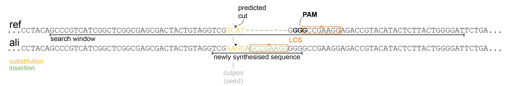
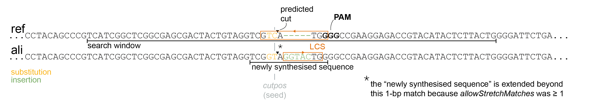
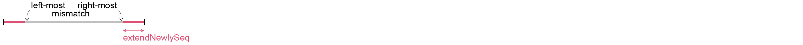

# "cutter" – the CRISPR mutations caller 

Main script is **alignFilterBack.command**, which aligns MiSeq fastq reads to a fasta reference (uses `bwa mem`), then optionally filters the resulting BAM file and converts it back to fastq files; one R1 containing Forward reads, one R2 containing Reverse reads. To know which fasta reference to use for each pair of fastq files, it reads a config.xlsx file with two columns: _well_ & _ref_.

Assuming filtering is ON, running on one pair of fastq files creates:
* first alignment: `well_reference.bam`, e.g. _D01_psen1_1.bam_, in directory _bam_.
* alignment after filtering: `well_reference_filt.bam`, e.g. _D01_psen1_1_filt.bam_, in directory _bamfilt_.
* fastq files after filtering, back-converted from the filtered bam file: `well_reference_R1.fastq.gz` & `well_reference_R2.fastq.gz`, e.g. _D01_psen1_1_R1.fastq.gz_ & _D01_psen1_1_R2.fastq.gz_, in directory _filterfastq_.

Directories _bam_, _bamfilt_, _filterfastq_ are created in the folder where the config file is.

For filtering, alignFilterBack uses **filterBam.command**, which can also be used alone.

Reference should be in fasta format, all in lowercase, except PAM (if any) in uppercase. Multiple PAMs are supported.  
e.g. file _cog1Ex12.fa_, which is:
```
> cog1Ex12
tgtcaataaccgcacgttcaacagtgtgaaaggtaagatggagctgtattctcaccggatctgactgctggccaaAGGaaggatgttatatggttCCTgagagttgatgctgttgctcctagacgtgaactgcttctctgtgcccgtcaacagccctaacaacac
```
There are two PAMs: `AGG` and `CCT`.

## Dependencies
* `samtools`
* `picard`  
I had to install with homebrew, conda version had a conflict with Java.
* `bwa-mem`

### alignFilterBack.command

* `-c` path to .xlsx config file. It must have two columns (and only two): _well_ and _ref_. For example, it could look like:

    | well | ref |
    |:---|:---|
    |A01|geneX_amplicon2.fa|
    |B11|geneY_amplicon1.fa|

* `-r` path to directory containing fastq reads.

* `-a` path to directory containing the reference sequences (fasta format) listed in the config file.

* `-l` whether to filter the alignment or no. To turn filtering OFF, do not include the flag; to turn filtering OFF, include the flag.

If filtering is ON (flag `-l` is present), you may also include those parameters: 

* `-e` minimum PhrEd score for an alignment to be kept, e.g. `-e 40`.

* `-f` minimum read span for an alignment to be kept, e.g. `-f 100` means the alignment should span at least 100 bp of the reference. Looking at read span, rather than read length, makes it agnostic to possible insertions/deletions. For example, a 100-bp deletion in a 150-bp wild-type amplicon would create a 50-bp read, but it would still span the full 150 bp of the reference.

* `-s` maximum proportion Soft-clipped for the alignment to be kept, e.g. `-s 0.2` would remove any alignment which has more than 20% of its length soft-clipped.

* `-d` padding around double-strand break site in bp, e.g. `-d 20` would remove any alignment which does not cover at least double-strand break site ± 20 bp. For this filter to work, the PAM should be in capital letters in the fasta reference, e.g. `...agggattAGGacct...`. Multiple PAMs are supported.

* `-p` whether (`-p yes`) or not (`-p no`) to keep only primary alignments.

#### Some examples:

To align a bunch of fastq files without filtering:
```
alignFilterBack.command -c ./config.xlsx -r ./reads/ -a ./refseqs/
```

With every possible filtering:
```
alignFilterBack.command -c ./config.xlsx -r ./reads/ -a ./refseqs/ -l -e 40 -f 100 -s 0.2 -d 20 -p yes
```

### filterBam.command

* `-i` path to input BAM file.

* `-a` path to directory containing the reference sequences (fasta format). Only needs the reference which was used to create the BAM file.

* `-e` minimum PhrEd score for an alignment to be kept, e.g. `-e 40`.

* `-f` minimum read span for an alignment to be kept, e.g. `-f 100` means the alignment should span at least 100 bp of the reference. Looking at read span, rather than read length, makes it agnostic to possible insertions/deletions. For example, a 100-bp deletion in a 150-bp wild-type amplicon would create a 50-bp read, but it would still span the full 150 bp of the reference.

* `-s` maximum proportion Soft-clipped for the alignment to be kept, e.g. `-s 0.2` would remove any alignment which has more than 20% of its length soft-clipped.

* `-d` padding around double-strand break site in bp, e.g. `-d 20` would remove any alignment which does not cover at least double-strand break site ± 20 bp. For this filter to work, the PAM should be in capital letters in the fasta reference, e.g. `...agggattAGGacct...`. Multiple PAMs are supported.

* `-p` whether (`-p yes`) or not (`-p no`) to keep only primary alignments.

* `-o` path to BAM file to output.

#### Example

```
filterBam.command -i ./bam/D01_cog1Ex12.bam -a ./refseqs/ -e 40 -f 100 -s 0.2 -d 20 -p yes -o D01_cog1Ex12_filt.bam
```

## Other scripts

### slc45a2Crispresso2loop.command
For ZPRI project, this script is to run CRISPResso2 analysis on _slc45a2_ TAA>TGG prime editing MiSeq samples, with standard pegRNA. It simply runs on a loop in a folder of fastq, there are no flags.

CRISPResso2 command is:
```
CRISPResso --fastq_r1 "$FWD" --fastq_r2 "$RVS" --amplicon_seq GTACAGTCTGGTGTGGCTCATAAGCCCCATTTTGGGTTTTATCCTACAGCCCGTCATCGGCTCGGCGAGCGACTACTGTAGGTCGTCATAAGGCCGAAGGAGACCGTACATACTCTTACTGGGGATTCTGATGTTAGTGGGCATGACTTTATTTCTAAATGGAGATGCAGTCACAACAGGTGGGTGA --amplicon_name slc45a2TAA --prime_editing_pegRNA_spacer_seq gactactgtaggtcgtcata --prime_editing_pegRNA_extension_seq tctccttcggccccatgacgacctacagt --prime_editing_pegRNA_scaffold_seq gttttagagctagaaatagcaagttaaaataaggctagtccgttatcaacttgaaaaagtgggaccgagtcggtcc
```

### about locus name in config.xlsx and meta.xlsx file

Do not use `_` or `.` in the locus names. If you have multiple loci for the same gene you can use `-` to differentiate them, such as: `msh2-1`, `msh2-2`, etc.

### miscellaneous notes

Read with only a mutation at edge is counted as reference, see alleleToMutation.

classifyReads, expedit = NA will never call edit (perhaps obvious), only two possible categories become reference and mutated.

Start position of insertion is first inserted nucleotide minus 1, i.e. last aligned nucleotide. Stop position is always the same as start.

Start position of deletion is first deleted nucleotide. Stop position is last deleted nucleotide.

About insertion: this makes it possible to have two mutations at the same position. For example, a 1-bp substitution directly followed by an insertion would give same position for the substitution and the start of the insertion. e.g.
```
TCGTCA-TGGGGCC
TCGTCTGTGGGGCC
```
Will give substitution A>T at position #6 and insertion G at position #6.

TODO: explain deletion can be shifted in some cases, e.g. cacng2b del6.

```
AGTATGGGGGTGTTT
AGTATG------TTT
AGTA------TGTTT
```
Both deletions are the same, just an arbitrary alignment algorithm decision. But if write expedit one way or another, will change analysis.


### about scaffold detection
We always align to the align to 5'–3' (genome direction) fasta reference sequence, so we can assume reads always represent the Forward genome.

After RTT, scaffold (standard) is `CCTGGC...` (reading in same direction as RT, i.e. from PBS to RTT).  
* PE on Forward strand: incorporates scaffold in Forward strand as `GGACCG...` (reading from the RTT-templated nucleotides)  
* PE on Reverse strand: incorporates scaffold in Reverse strand as `GGACCG...` (reading from the RTT-templated nucleotides), which appears in the Forward strand as `CCTGGC...` (reading from the RTT templated nucleotides) or `...CGGTCC` reading 5'–3' genome.

Defined RHA position (`rhapos`) as last nucleotide templated from the RTT (maybe "ligation position" would be a better name).
* PE on Forward strand: expect scaffold insertion to start at `rhapos` and scaffold substitution to start (first mismatch) at `rhapos + 1`, both starting with `G`.
* PE on Reverse strand: expect scaffold insertion & substitution to stop at `rhapos - 1`, both ending with `C` (as we are looking at Forward strand reads).  

About positions: a mutation's start is always the same or lower number than its stop (so more 5' on reference/genome).
* PE on Forward strand: scaffold mutation's `start` is closer to `rhapos` (just after), and mutation _starts_ with G. 
* PE on Reverse strand: scaffold mutation's `stop` is closer to `rhapos` (just before), and mutation _ends_ with C.  

TODO: for filtering, did I take this into account the reverse/forward thing? Is it OK to have a symmetrical window? Looking at all positions between start and stop should be OK.
TODO: I am not sure about decision to add filtered-out reads as reference reads. Probably they should just be thrown out? i.e. they will be removed from mutated reads & total reads. Currently, by switching their labels to "ref", we removing them from mutated reads, but keeping them in total reads. ! those "manually edited to ref" reads will have ref sequence as overall reference sequence & ali sequence as NA. On the other hand, sequences directly called as ref before filterMutations (including those which were called as ref because the mutation was at the edge) have the real ref & ali sequences.

### classifyReads

Assigns categories to individual reads. Every read is assigned to one and only one category.

There are two modes: `precise` and `frameshift`.

Mode `precise` is when a precise edit is expected, for example in the case of homology-directed repair, base editing, or prime editing. It will assign to each read one of the following labels:
* `reference` if the read is reference; that is, there is no mutation* in the editing window.
* `scaffold` (optional) if the read contains evidence of scaffold incorporation. This is most relevant in the case of prime editing. This category trumps all others; that is, if there is evidence of scaffold incorporation, the read is assigned to the `scaffold` category, regardless of other edits/mutations.
* `mutated` if the edit is absent and the read contains one or more unwanted mutations*. The edit could be absent either because the region is reference or because the region was deleted.
* `impure` if the edit is present but the read also contains one or more unwanted mutations*.
* `pure` if the edit is present and no other unwanted mutations* are present. 

>*Argument `unwantedSubs` (see below) controls whether substitutions count as unwanted mutations or no.

Mode `frameshift` is when generating indels with standard CRISPR-Cas9. It will assign to each read one of the following labels:
* `reference` if the read is reference (no mutation around the PAM).
* `indel_inframe` if the read has one or more indels but their summed length is a multiple of three (e.g. the read has a deletion of 5 bp and an insertion of 2 bp: –5 + 2 = –3 bp).
* `indel_frameshift` if the read has one or more indels and their summed length is not a multiple of three (e.g. the read has a deletion of 5 bp).

* `mut` mutation table, created by `callMutations`.

* `mode` either `precise` or `frameshift`, see above. Default is `precise`.

* `scaffDetect` whether (`TRUE`) or not (`FALSE`) to detect scaffold incorporations. Default is not to detect scaffold incorporations (`scaffDetect=FALSE`).

* `whichScaff` which scaffold sequence is used. Options are: `std`, `std2`, `altAAAA`, `altUAAA`, `altGAAA`. It is not absolutely essential to know for certain as, in most cases, we only look whether the last (3') nucleotide of the scaffold is present in the sequence at the expected position and this position does not vary between the possible scaffolds. Better would be to know whether the scaffold nucleotides after the RTT (reading from the RTT into the scaffold) are `CC` (set `whichScaff="std"`) or `CG` (set `whichScaff="std2"`). Default is `whichScaff='std'`.

* `scaffWin` window for detection of scaffold incorporations, where position 0 is `rhapos` (the last nucleotide that is templated from the RTT). When PE is on the Forward strand, default is `scaffWin=c(0, 0)`; when PE is on the Reverse strand, default is `scaffWin=c(-1, -1)`. Do not mention or set as `scaffWin=NA` to use the default.  
Note setting is not intuitive to set correctly.  
If PE is on the Forward strand, the theoretical scaffold _insertion_ starts exactly at `rhapos` (by convention, start position of an insertion is last aligned nucleotide, so the insertion starts just after).  
If PE is on the Reverse strand, the theoretical scaffold _insertion_ stops exactly at `rhapos - 1`.  
On Forward strand, this changes if scaffold incorporation appears as a _substitution_. In this case, first mismatch will be `rhapos + 1`. Do not attempt to account for this, function will do so internally. Assume scaffold incorporations are always insertions.  
On Reverse strand, scaffold _substitutions_ do not change the situation. We expect last mismatch to be `rhapos - 1 `.  
The situation gets more complicated if the sequence at the expected scaffold incorporation site happens to match what the scaffold incorporation would be. Find examples in figure below.

* `unwantedSubs` whether (`TRUE`) or not (`FALSE`) to call base substitutions as unwanted mutations. `TRUE` is more stringent but will call sequencing errors. If `FALSE`, "indels" is an acceptable name for the "mutated" read category.

* `exportpath` path to .csv file to create, e.g. `exportpath='~/myexperiment/mutcalls.csv'`


On top of above, if the mutation (insertion or substitution) that is detected as potential scaffold incorporation is longer than 1 bp, we also check that the mutation's _second_ nucleotide also matches the expected scaffold sequence, which further reduces false positive detections. The process is the same as detailed in the figure, just shifting positions by 1 bp to the right (+1) when PE is on the Forward strand or 1 bp to the left (−1) when PE is on the Reverse strand.

### simulateDel

Simulates deletions and add them to the mutation table as one simulated sample. `detectMHdel` can then be run on the entire mutation table, including the simulated sample. The goal is to provide a baseline for MH deletions expected from random, as a kind of null hypothesis (see comment about this below).

* `mut` mutation table, created by `callMutations`.

* `nreads` number of reads to simulate, which is also number of rows added to the mutation table.

* `mincov` setting for internal function `fitDelLengths` which fits the deletion lengths using a log-normal distribution. Minimum coverage (number of reads) of one sample to use it when fitting. Goal is to exclude samples with low coverage because we cannot be confident in the the deletion frequencies (e.g. 1 read with a 11-bp deletion in a sample with 4 reads probably does not mean that the frequency of this 11-bp deletion is 25%). Default is 100 (`mincov=100`).

* `cutpos` position of cut site in reference sequence used for alignment (first nucleotide is #1). This position should point to exactly the nucleotide before the cut. For example, for reference sequence (PAM in uppercase) `attctagactNGGcattca`, we expect `cutpos=7` (position of `g`).

* `cutDelbp` generally, deletions must remove the 'cutpos' nucleotide, but we relax this requirement for very short deletions. Setting controls this length threshold, it is the minimum size of a deletion that must delete the 'cutpos' nucleotide. Default is 3 bp (`cutDelbp=3`), meaning any deletion that is 3 bp or longer must delete the 'cutpos' nucleotide. For shorter deletion, see below.

* `awayfromCut` if the deletion is very short (shorter than `cutDelbp` bp), how far from the cut do we allow it to be. Default is 4 bp (`awayfromCut=4`).

* `fit_meanlog` $\mu$ parameter of the log-normal distribution describing observed deletion lengths after Cas9-mediated double-strand breaks in zebrafish embryos. Default is `fit_meanlog=1.955957`.

* `fit_sdlog` $\sigma$ parameter of the log-normal distribution describing observed deletion lengths after Cas9-mediated double-strand breaks in zebrafish embryos. Default is `fit_sdlog=0.8970051`.

> See fitDelLengths_notes.R for details about fitting typical deletion lengths. It uses sequencing data from n = 233 larvae (191 injected with Cas9 RNP) with mutations at n = 38 loci.

    simulateDel example: deletion size is 2 bp (which is below `cutDelbp`) and `awayfromCut` is 4 bp, then in the following sequence (PAM is GGG, `cutpos` nucleotide is C, actual cut is at ^):
    ```
    aggtcgtC^atgGGGccg
    ```

    We consider the following deletions: 
    ```
    agg--gtC^atgGGGccg  
    aggt--tC^atgGGGccg  
    aggtc--C^atgGGGccg  
    aggtcg--^atgGGGccg  
    aggtcgt-^-tgGGGccg  
    aggtcgtC^--gGGGccg  
    aggtcgtC^a--GGGccg  
    aggtcgtC^at--GGccg  
    aggtcgtC^atg--Gccg
    ```

    TODO should make a figure? Perhaps would be clearer.

    Because all these deletions remove a nucleotide that is at most within 4 bp (`awayfromCut`) from the cut.

`simulateDel` adds rows to mutation table as:

* `sample` is "999999_Z99_simulated"
* `rundate` is "999999"
* `locus` is "simulated"
* `well` is "Z99"
* any other column present in mutation table (typically those added from meta file) is filled with NA.

Small comment on MH deletions expected from random: assuming only MH of 1 bp, and taking as example a 3-bp deletion like so:
```
... 1 2 3 4 5 6 7 ...
... N N N N N N N ...
... N N - - - N N ...
```
Then a MH deletion with MH 1 bp is detected if nucleotide #3 matches nucleotide #6 (`MHside` left, i.e. left MH is deleted) _OR_ nucleotide #2 matches nucleotide #5 (`MHside` right, i.e. right MH is deleted), that is:
```
P(3=6) | P(2=5)
```
which is
```
P(3=6) + P(2=5)
```

Probability that two nucleotides picked as random match is
```
P(both A) + P(both C) + P(both G) + P(both T)  
```
where e.g.
```
P(both A) = P(first is A) * P(second is A) = 1/4 * 1/4 = 1/16
```
So probability that two random nucleotides match is:
```
1/16 + 1/16 + 1/16 + 1/16 = 4/16 = 1/4
```

So 
```
P(3=6) + P(2=5) = 1/4 + 1/4 = 2/4 = 50%
```

On top of this, there is a (much smaller) probability of a random 2-bp MH, etc.

Having said this, this is all assuming a completely random sequence. In practice, the probability will vary based on the sequence (e.g. a sequence which is all `...GGGGGG...` will give a MH detection 100% of the time); this is why we generate random deletions at the locus, rather than assume random probabilities.

### detectMHdel

MH stands for microhomology.

Runs on complete mutation table but currently only detects MH for deletions. If type is ref or sub or ins, returns all NA.

* `mut` mutation table, created by `callMutations`.

* `minMHlen` minimum length allowed for the MH, in bp. Default is 2 bp.

Typical case looks like:  
`MH - inner sequence - MH`  
and deleted sequence is
`MH - inner sequence` or `inner sequence - MH`

Columns it adds to mutation table:

* `MHside` side of the deleted MH. The MH left in the sequence after deletion is at the opposite side. Presumably, this is an arbitrary decision from the alignment algorithm as it could align the deletion shifted to the left or to the right. Value `none` with all other columns (below) being `NA` indicates a deletion that was analysed but that did not return any MH.

* `MHbp` length of the MH in bp.

* `leftMHstart` start position (position of first nucleotide) of the left MH.

* `leftMHstop` stop position (position of last nucleotide) of the left MH.

* `rightMHstart` start position (position of first nucleotide) of the right MH.

* `rightMHstop` stop position (position of last nucleotide) of the right MH.

* `innerSeq` inner sequence. This is the sequence flanked by the two MHs (cf. schematic above).

* `innerbp` length of inner sequence in bp.

* `leftFlapSeq` sequence of the 3'-flap on the left of the cut. I do not know for sure this is what the flap looked like as there have could been resection of the end before annealing of the MH. More precisely: sequence after the left MH and before the cut.

* `leftFlapbp` length of the left flap in bp.

* `rightFlapSeq` sequence of the 3'-flap on the right of the cut. I do not know for sure this is what the flap looked like as there have could been resection of the end before annealing of the MH. More precisely: sequence after the cut and before the right MH.

* `rightFlapbp` length of the left flap in bp.

All positions (`leftMHstart`, `leftMHstop`, `rightMHstart`, `rightMHstop`) refer to the reference sequence used for alignment (first nucleotide is #1). This is not always the same as the `ref` stored in the mutation table. In the case of an insertion, hyphens are added in the `ref` sequence for alignment, which shifts the positions.

`detectMHdel` runs on complete mutation table row by row and adds columns to it.

There are two, not mutually exclusive, exceptions to the typical case represented above:  

* **exception #1**: left MH is directly next to right MH, for example (real): 
    ```
    TAGGTCGTCATGGGGCCG
    TAGGTC---ATGGGGCCG
    ```
    (MH is `GTC`)  
    In this case, there is no inner sequence as the two MHs are directly one after the other. `innerSeq` is thus an empty string `""` of length (`innerbp`) 0. There are no left and right 3'-flap, so `leftFlapSeq`, `leftFlapbp`, `rightFlapSeq`, `rightFlapbp` are all NA.

* **exception #2**: cut is not between the two MHs, i.e. left MH stops after the cut or right MH starts before the cut. For example (real):
    ```
    GGCGAGCGACTACTGTAGGTCGTCATG*GGG*CC
    GGCG------------------TCATG*GGG*CC
                           ^
    ```
    (MH is `CG`, PAM is `*GGG*`, `cutpos` nucleotide is indicated with `^`)

    I cannot easily explain such case with MMEJ (how would MH anneal if both MHs are on the same side after cut?), but the fact that an MH is present seems to be a telltale sign. An option is that Cas9 did not cut at the expected site, but somewhere between the two MHs. I decided to still record those MH as they are potentially interesting. `innerSeq` and `innerbp` are still recorded, but we cannot tell anything about the 3'-flaps as it is unclear where the cut occurred, so `leftFlapSeq`, `leftFlapbp`, `rightFlapSeq`, `rightFlapbp` are all NA.

`detectMHdel` tries both left MH and right MH for each deletion. For each side, it looks for the longest MH, starting with `minMHlen`. The maximum MH size is set as the length of the deletion. If the deletion has MH on both sides (I think this is extremely rare), it compares both and keeps the longest one. If both are the same size (I do not know if this would ever happen), it will all record the left one.

### ggMHdel

Plots a stacked barplot showing, for each sample, proportions of reads with deletion flanked by microhomologies of given lengths. Colours in the stacked barplot represent the length of the microhomology, with darker colours representing longer microhomologies.

* `mut` mutation table, created by `callMutations` then ran through `detectMHdel` (and optionally `simulateDel` before that).

* `min_del_nreads` minimum number of reads with deletion a sample should have to be included in the plot. Default is 50 (`min_del_nreads=50`).

* `colourLight` colour for the shortest microhomology (typically 1 bp). This should be the lightest colour, colours for longer microhomologies will be darker versions of this one.

* `grporder` order of the groups, i.e. order of the subplots (facets). `NA` will follow alphabetical order. For example, `grporder=c('Cas9', 'PE2')`.

* `legendOrNo` whether (`TRUE`) or not (`FALSE`) to write the legend. Default is `TRUE`.

* `titleOrNo` whether (`TRUE`) or not (`FALSE`) to write the titles for each group. Default is `TRUE`.

* `xtextOrNo` whether (`TRUE`) or not (`FALSE`) to write the sample names. Default is `TRUE`.

* `ytextOrNo` whether (`TRUE`) or not (`FALSE`) to write the Y axis ticks. Default is `TRUE`.

* `ynameOrNo` whether (`TRUE`) or not (`FALSE`) to write the Y axis name. Default is `TRUE`, which will write "% of reads with deletion".

* `exportpath` full export path. It has to finish by .pdf.

* `width` width of the pdf in mm. Default is 110 (`width=110`).

* `height` height of the pdf in mm. Default is 65 (`height=65`).

### detectTemplatedIns

Detects whether insertions were templated from sequences flanking the cut.

We talk here of "templated insertions" but an insertion is frequently followed or preceded by substitutions. This is not a coincidence but rather reflects the DNA synthesis that occured during repair (typically TMEJ). Therefore, the insertion is better analysed by taking the entire "newly synthesised sequence" into account, not just the inserted sequence.

Runs on complete mutation table and writes extra columns. For all the rows which have `type` as `ref` or `sub` or `del`, the extra columns are `NA`. The extra columns can only contain data if the `type` is `ins`. In practice, `detectTemplatedIns` runs on complete alignments (pairs of one aligned reference & one read, columns `ref` and `ali`), not just on the detected insertion.

Here are a couple of examples to help understand how the detection works (LCS stands for Longest Common Substring/sequence). Refer to those cartoons when reading below.

Example of a forward match:


Example of reverse match:


In both cases;
* the "newly synthesised sequence" is defined like so:

* the "search window" is defined like so:


* `mut` mutation table, created by `callMutations`.

* `minLCSbp` to detect templated insertion, we compare the newly synthesised sequence to the region around the cut and extract the longest common substring (sequence). We should not conclude that we detected a templated insertion when it is just a small sub-sequence matching as this could be a coincidence. `minLCSbp` controls the minimum length of the common sub-sequence. Below this length, we conclude that the match (the common sub-sequence) is not long enough to be convincing. Rather, it could just be a coincidence so do not return the detection***. Above this length, we conclude that the match (the common sub-sequence) is long enough to be convincing and we return the detection.
A more jargony definition of `minLCSbp`: minimum length of (in bp) of the longest common substring (sequence) between the "newly synthesised sequence" and the "search window".  
Default is 5 bp (`minLCSbp=5`).  
Note, deciding on `minLCSbp` should take into account setting `extendNewlySeq`. For example, if we extend the newly synthesised sequence by 3 bp on either side, we are guaranteed to always find a common sub-sequence of at least 3 bp, as the edges of the newly synthesised sequence will always match the reference. In other words, `minLCSbp` should always be greater than `extendNewlySeq`. For example, if `extendNewlySeq=3`, `minLCSbp=5` may still return false positives as the probability of a 5-bp common substring is only the probability that the 4th and 5th nucleotide match the reference (we know for sure that the first three will match), i.e. around 1/4 * 1/4 = 6%.

* `allowStretchMatches` to extract the "newly synthesised sequence", we start with the modified nucleotide (mismatch between the aligned reference & read) that is closest to the cut (which I call "seed") and extend it as long as possible in either direction (leftward and rightward). If the "newly synthesised sequence" was genuinely templated from a sequence around the cut, we do not expect it to match the reference. However, we do not expect no match _at all_. After all, even nucleotides taken as random will match 25% of the time. Therefore, we expect the "newly synthesised sequence" to mostly not match the reference (insertions or substitutions), interspaced by some "lucky matches". `allowStretchMatches` controls the maximum length of a stretch of "lucky matches" we allow when extracting the newly synthesised sequence. In practice, we try to extend the newly synthesised sequence 1 bp at a time, first leftward then rightward. At each new bp, we ask "in the next 5 bp, are there any mismatches?". If yes, we take this new bp as part of the newly synthesised sequence and go to the next one. If no, we stop trying to extend the newly synthesised sequence further in this direction, as the next few ("few" being `allowStretchMatches`) match so it looks like we reached the end of the newly synthesised sequence. Default is 5 bp (`allowStretchMatches=5`).  
The dilemma when choosing `allowStretchMatches` is: if it is too long, we risk taking in the newly synthesised sequence nucleotides which were not actually templated from the regions flanking the cut (e.g. a sequencing error that just happens to be close); if it is too short, we risk extracting a newly synthesised sequence that is too short because we were too stringent and stopped as soon as there were a few "lucky matches".

* `extendNewlySeq` the broad logic when extracting the newly synthesised sequence is to get the sequence of the aligned read from the first (leftmost) to the last (rightmost) mismatch. However, in a similar logic as for `allowStretchMatches`, this may be slightly too stringent as there will often be "lucky matches" (two nucleotides picked at random will match 25% of the time). The solution here is to extend slightly the newly synthesised sequence in both directions by `extendNewlySeq` bp. For example, when `extendNewlySeq=3`, the newly synthesised sequence is guaranteed to look like:  
`mmmx...xmmm`  
where m is a match and x is a mismatch. Default is 3 bp (`extendNewlySeq=3`).

* `searchWindowStarts` when searching for the template in the reference sequence, how far from the cut are we allowed to look? Of course we could take the entire reference as "search window", but this risks finding red herrings (sequences far from the cut are unlikely to be taken as template during repair), so `searchWindowStarts` allows to limit the size of the search window. Precisely, `searchWindowStarts` is: of all the nucleotides that may have served as template for the newly synthesised sequence, how far from the cut do we allow the closest one to the cut to be. In practice, we define the search window in the reference sequence as: `... ^ ...`, where `^` is the cut position and each `...` is of length `searchWindowStarts + length of newly synthesised sequence`. As can be seen, we take into account the length of the newly synthesised sequence, so you should not try to take it into account when deciding on `searchWindowStarts`, just decide how far can _any nucleotide of the template_ be from the cut. Default is 20 bp (`searchWindowStarts=20`).  
For example, if `searchWindowStarts=20` and the newly synthesised sequence we are analysing is of length 13 bp, then the search window in the reference sequence will be:  
`~43bp~ ^ ~43bp~`, i.e. a window of 86 bp centered on the cut position.

Columns it adds to mutation table:

* `lcbp` length (in bp) of the longest common substring (sequence) between the newly synthesised sequence and the search window. This is guaranteed to be longer or equal to `minLCSbp`.

* `lcseq` sequence of this longest common substring (sequence).

* `lcdir` direction of the match. `fw` means that `lcseq` matches a part of the search window read from left to right; `rv` means that `lcseq` matches a part of the search window read from right to left (i.e. `lcseq` has to be reversed to make it match the search window).

* `lcStart` position, in original reference sequence, of the start of the longest common substring (sequence), i.e. (roughly) start of the template.

* `lcStop` position, in original reference sequence, of the end of the longest common substring (sequence), i.e. (roughly) end of the template.

In the original reference sequence, the sequence from `lcStart` to `lcStop` is guaranteed to give `lcseq` (when reading from right to left if `lcdir` is `rv`).

In the mutation table, every row that has mutation `type` `ref` or `sub` or `del` will get new columns:
```
lcbp = NA
lcseq = NA
lcdir = NA
lcStart = NA
lcStop = NA
```

*** If thresholds `cutdist` or `minLCSbp` are not met, we return:
```
lcbp = 0
lcseq = NA
lcdir = NA
lcStart = NA
lcStop = NA
```

`lcbp` as NA or 0 allows to differentiate the two cases. If `lcbp` is NA, we did not run the detection of templated insertions. If `lcbp` is 0, we ran the detection of the templated insertions but the result was not convincing (`cutdist`: the mutation was too far from the cut; or `minLCSbp`: the best common substring was not long enough).

When looking for the longest common substring between the newly synthesised sequence and the search window, `detectTemplatedIns` tests both directions of the search window (_not_ the reverse-complement, simply the search window read from left to right or read from right to left). I have seen examples where a reverse match is convincing (i.e. a big chunk of the newly synthesised sequence seems to come from the reference read from right to left, see cartoon "Example of reverse match" above).

Currently, `detectTemplatedIns` only returns _the_ longest common substring (sequence). In practice, the newly synthesised sequence is often a patchwork of sequences from multiple origins, but we do not currently attempt to locate all the origins (templates).

There can be multiple substrings that are equally good (long). For example, `detectTemplatedIns` may find two substrings which are both 8 bp. If the two substrings are in opposite directions, it will preferentially return the _forward_ match (i.e. the newly synthesised sequence matching the search window read left-to-right). If the two substrings are in the same direction, it is arbirary which one is returned.


### version history

* v1

* v2  
Detection of scaffold incorporation, currently just looks at substitutions or insertions that starts with G around end of RTT (end of RHA). Can control detection with `rhapos` and `scaffdetectwin`.

* v3  
    * Detection of microhomology for deletions, see `detectMHdel`.  
    * `callMutations` now records every reference & aligned sequence from CRISPResso2 alleles table.

* v4  
Detection of insertions templated from sequences flanking the cut (`detectTemplatedIns`).

* v5  
New function `simulateDel` to simulate reads with deletions to provide a "null hypothesis" baseline for `detectMHdel`.

* v6  
More precise detection of scaffold incorporation in `preciseClassify_one`.

* v7
Better fit of deletion lengths using Cas9MiSeqDB dataset v0 (n = 38 loci, n = 233 samples). See fitDelLengths_notes.R for details about fitting the log-normal distribution. The parameters of the distribution are now set as defaults in `simulateDel`.